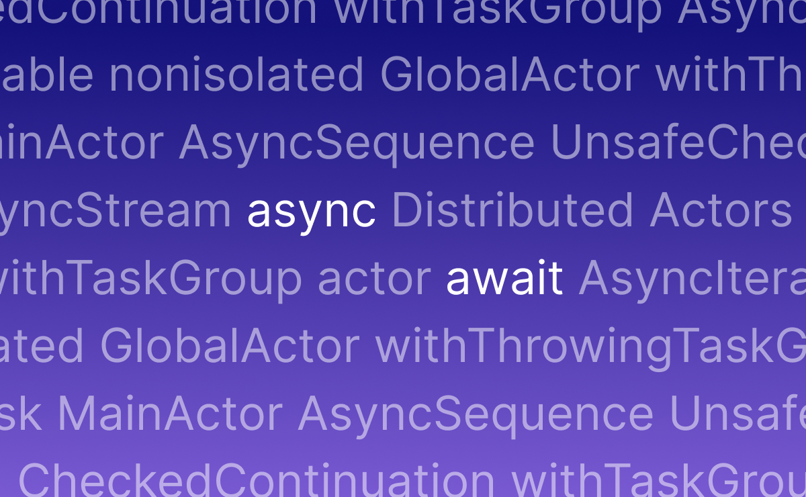

    

    <a>A hand-curated list of Swift async/await resources</a>

## WWDC21
- [Meet async/await in Swift](https://developer.apple.com/videos/play/wwdc2021-10132)
- [Protect mutable state with Swift actors](https://developer.apple.com/videos/play/wwdc2021-10133)
- [Explore structured concurrency in Swift](https://developer.apple.com/videos/play/wwdc2021-10134)
- [Discover concurrency in SwiftUI](https://developer.apple.com/videos/play/wwdc2021-10019)
- [Meet AsyncSequence](https://developer.apple.com/videos/play/wwdc2021-10058)
- [Swift concurrency: Update a sample app](https://developer.apple.com/videos/play/wwdc2021-10194)
- [Use async/await with URLSession](https://developer.apple.com/videos/play/wwdc2021-10095)
- [Bring Core Data concurrency to Swift and SwiftUI](https://developer.apple.com/videos/play/wwdc2021-10017)
- [Swift concurrency: Behind the scenes](https://developer.apple.com/videos/play/wwdc2021-10254)

## WWDC22
- [Meet Swift Async Algorithms](https://developer.apple.com/videos/play/wwdc2022/110355)
- [Eliminate data races using Swift Concurrency](https://developer.apple.com/videos/play/wwdc2022/110351)
- [Meet distributed actors in Swift](https://developer.apple.com/videos/play/wwdc2022/110356)

## WWDC23
- [Beyond the basics of structured concurrency](https://developer.apple.com/videos/play/wwdc2023/10170)
- [Discover streamlined location updates](https://developer.apple.com/videos/play/wwdc2023/10180)

## Books
- [Modern Concurrency in Swift](https://www.raywenderlich.com/books/modern-concurrency-in-swift) by [Marin Todorov](https://twitter.com/icanzilb)
- [Swift Concurrency by Example](https://www.hackingwithswift.com/quick-start/concurrency) by [Paul Hudson](https://twitter.com/twostraws)
- [Practical Swift Concurrency](https://practicalswiftconcurrency.com) by [Donny Wals](https://twitter.com/DonnyWals)
- [Modern Concurrency on Apple Platforms](https://swiftasyncbook.com) by [Andy Ibanez](https://twitter.com/AndyIbanezK)
- [The Curious Case of the Async Cafe.An Introduction to Modern Concurrency in Swift](https://pragprog.com/titles/d-dsasync/the-curious-case-of-the-async-cafe/) by [Daniel H Steinberg](https://twitter.com/dimsumthinking)

## Articles
- [Getting Started with async/await in SwiftUI](https://peterfriese.dev/swiftui-concurrency-essentials-part1) by [Peter Friese](https://twitter.com/peterfriese)
- [async/await in SwiftUI](https://www.raywenderlich.com/25013447-async-await-in-swiftui) by [Audrey Tam](https://twitter.com/mataharimau)
- [Concurrency](https://www.swiftbysundell.com/discover/concurrency) by [John Sundell](https://twitter.com/johnsundell)
- [Async await in Swift explained with code examples](https://www.avanderlee.com/swift/async-await) by [Antoine van der Lee](https://twitter.com/twannl)
- [Swift actors tutorial - a beginner's guide to thread safe concurrency](https://theswiftdev.com/swift-actors-tutorial-a-beginners-guide-to-thread-safe-concurrency) by [Tibor Bödecs](https://twitter.com/tiborbodecs)
- [Modern Concurrency in Swift](https://www.andyibanez.com/posts/modern-concurrency-in-swift-introduction/) by [Andy Ibanez](https://twitter.com/AndyIbanezK)
- [Web API Client in Swift](https://kean.blog/post/new-api-client) by [Alex Grebenyuk](https://twitter.com/a_grebenyuk)
- [Iterating over web socket messages with async / await in Swift](https://www.donnywals.com/iterating-over-web-socket-messages-with-async-await-in-swift) by [Donny Wals](https://twitter.com/donnywals)
- [Async await in Swift: The Full Toolkit](https://www.emergetools.com/blog/posts/swift-async-await-the-full-toolkit) by [Jacob Bartlett](https://x.com/jacobs_handle)
- [A Swift Concurrency Glossary](https://www.massicotte.org/concurrency-glossary) by [Matt Massicotte](https://bsky.app/profile/massicotte.org)

## Videos
- [Concurrency](https://www.pointfree.co/collections/concurrency) by [Point-Free](https://twitter.com/pointfreeco)
- [Swift 5.5: Async Await Operations (Xcode 13, iOS 15, 2021) - iOS for Beginners](https://youtu.be/_n6XnabuYO8) by iOS Academy
- [How do you go from completionHandler to async / await? 🤔](https://youtu.be/9CI8O7iufDI) by [Vincent Pradeilles](https://twitter.com/v_pradeilles)
- [Distributed Systems with Swift](https://youtu.be/7yu6mEq8R2Q) by [Konrad Malawski](https://twitter.com/ktosopl)
- [Swift Concurrency Under the Hood - iOS Conf SG 2022](https://youtu.be/wp5vIVxABFk) by [Marin Todorov](https://twitter.com/icanzilb)
- [Distributed actors и где они обитают](https://youtu.be/yvBG333wFmI) by [Eugene Antropov](https://www.linkedin.com/in/antigp)
  
## Courses
- [Async/Await Fundamentals - A Beginner's Guide](https://azamsharp.teachable.com/p/async-await-fundamentals-a-beginners-guide) by [Mohammad Azam](https://twitter.com/azamsharp)

## Libraries
- [Async Algorithms](https://github.com/apple/swift-async-algorithms) by Apple
- [Swift Distributed Actors](https://github.com/apple/swift-distributed-actors) by Apple
- [AsyncGraphics](https://github.com/heestand-xyz/AsyncGraphics) by [Anton Heestand](https://twitter.com/heestand_xyz)
- [AsyncCompatibilityKit](https://github.com/JohnSundell/AsyncCompatibilityKit) by [John Sundell](https://twitter.com/johnsundell)
- [CollectionConcurrencyKit](https://github.com/JohnSundell/CollectionConcurrencyKit) by [John Sundell](https://twitter.com/johnsundell)
- [TaskGroupsResultBuilder](https://github.com/AvdLee/TaskGroupsResultBuilder) by [Antoine van der Lee](https://twitter.com/twannl)
- [swift-concurrency-extras](https://github.com/pointfreeco/swift-concurrency-extras) by [Point-Free](https://twitter.com/pointfreeco)
